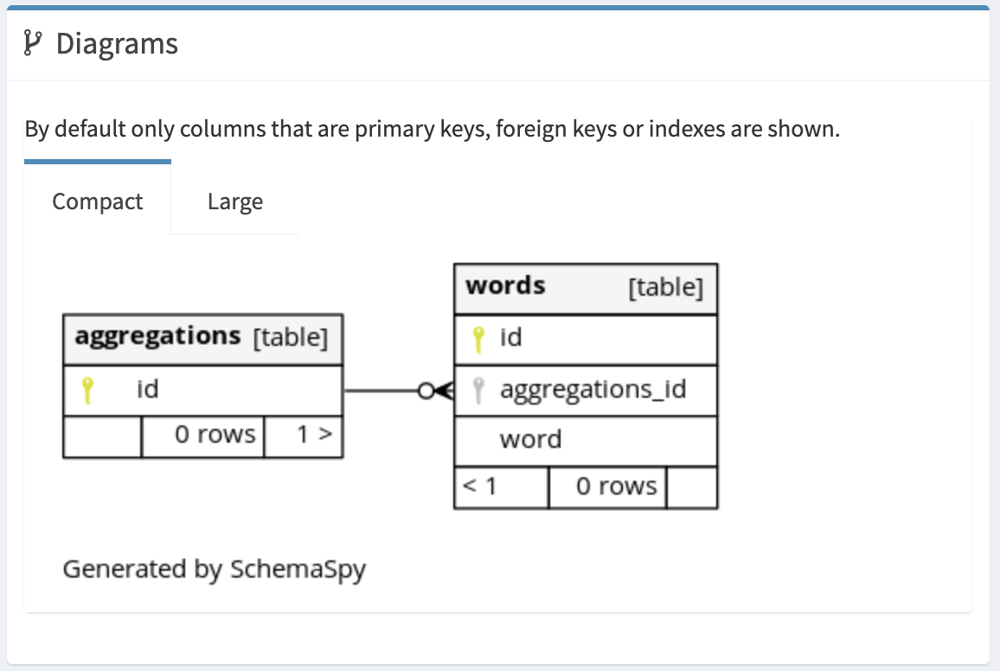

## About
* php の 練習
* 単語を登録して検索できる

## Install

* Dockerが稼働することが前提

```
git clone git@github.com:iitenkida7/lesson_search.git

cd lesson_search

docker-compose up -d

# composer install
make composer-install

# DBテーブルの作成
make migrate

# 初期データ の インサート
make data-insert
```

## Let's access!(実行)

* Webページ
  - http://localhost:8000/

* phpMyadmin
  - http://localhost:8080/


## ER図



* CREATE TABLE の SQL は[こちら](https://github.com/iitenkida7/lesson_search/blob/master/docker/mysql/migrate.sql)

* SchemaSpy による DBドキュメント（ER図）生成は `make erd` を実行
  - ./erd/index.html が生成されるので開くと閲覧できる。

